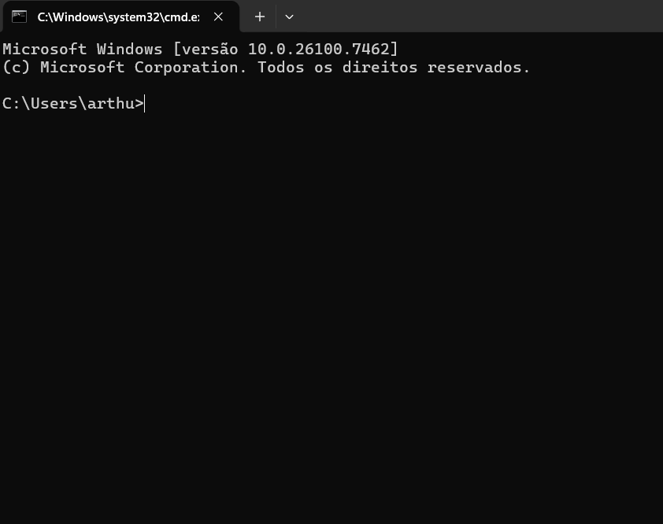
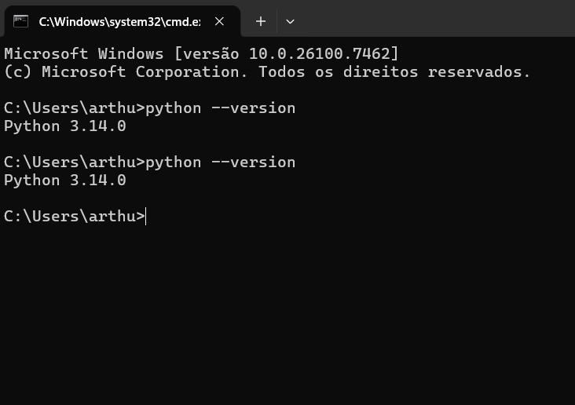
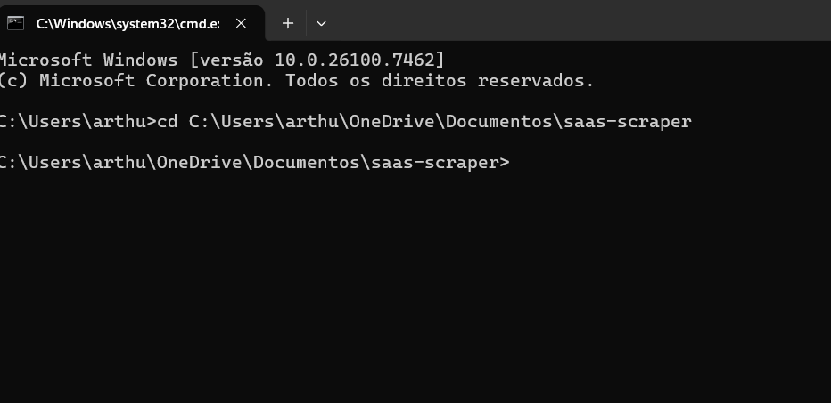
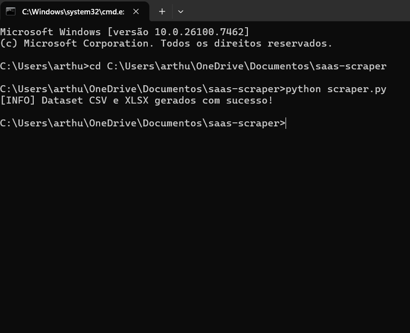
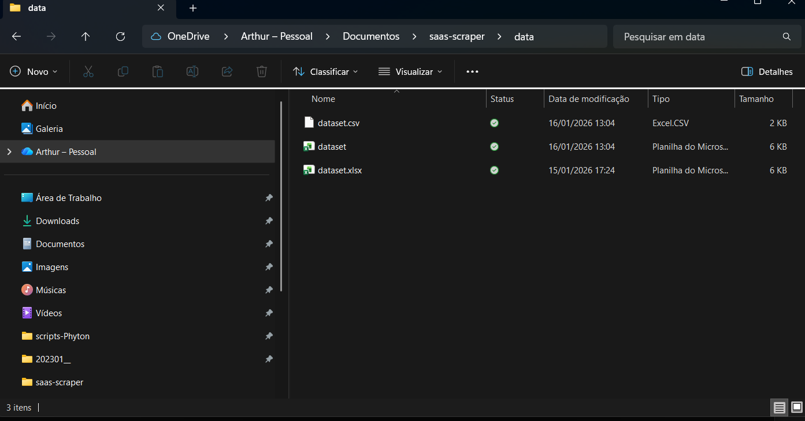
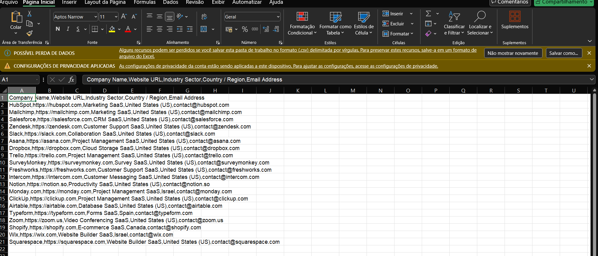
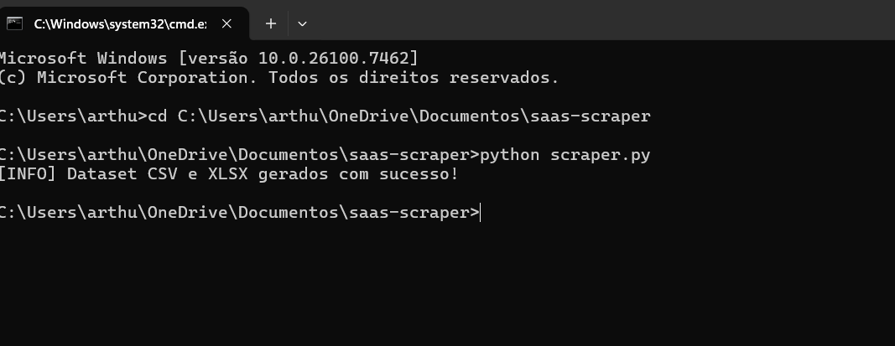
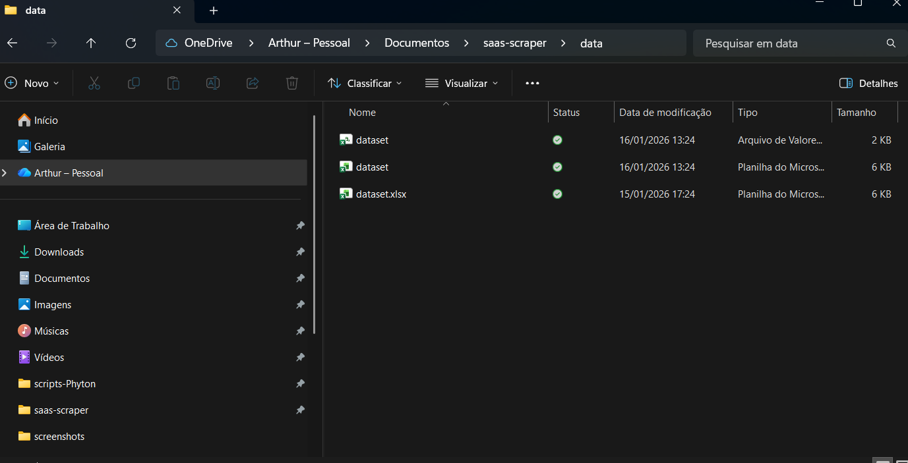
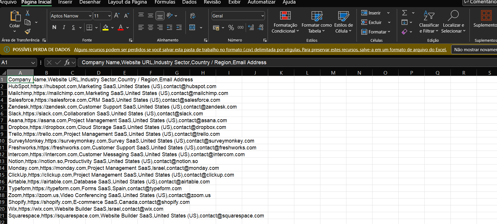

“Automated Web Scraper for SaaS Lead Generation | Python & Excel/CSV Export”
“Automatically collects and structures SaaS company data, saving hours of manual research and providing actionable insights for sales and marketing teams.”
This project demonstrates an automated data extraction workflow built in Python.  
It collects structured information from a list of SaaS companies and exports the data into CSV and XLSX formats.

---

## 🔧 Technologies Used
- Python
- Requests
- BeautifulSoup4
- Pandas

---

## 📌 Features
✔ Extracts structured company data  
✔ Easy to expand with more fields  
✔ Exports to CSV and Excel (XLSX)  
✔ Clean and reusable Python code  
✔ Ideal for Lead Generation, Market Research, Automation Projects  

---

## 📁 Project Structure
```
.
├── scraper.py            # Main scraping logic
├── requirements.txt      # Dependencies
├── sample_output.csv     # Example extracted dataset
├── data/                 # Exported results (auto-generated)
├── screenshots/          # Visual documentation
└── README.md             # Project documentation
```

---

## 📸 Screenshots
## 📸 Execution Preview

### 1. Terminal Opened


### 2. Python Version Check


### 3. Navigated to Project Folder


### 4. Running the Scraper


### 5. Output Files Generated


### 6. Extracted Data Preview


### 7. Scraper Completed Successfully


### 8. Exported Output Files


### 9. Data Folder Contents


### 10. CSV Output Preview


### 11. Excel Output Preview


---

## 🧾 Sample Output
Example dataset included in: `sample_output.csv`

---

## ▶ How to Run

1. Install dependencies:
```
pip install -r requirements.txt
```

2. Run the scraper:
```
python scraper.py
```

3. Check the exported files in `/data`

---

## 📦 Output Formats
✔ CSV  
✔ XLSX  

---

## 📈 Use Cases
This project can be adapted for:

- Lead generation
- Market research
- SaaS discovery
- Automation workflows
- Competitive analysis

---

## 💡 Notes
- Code is modular and can be extended to scrape new fields.
- Can integrate with APIs or CRMs if needed.

---

## ✔ Status
Project ready for demonstration and extension.
