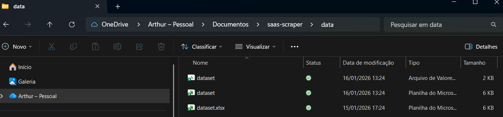
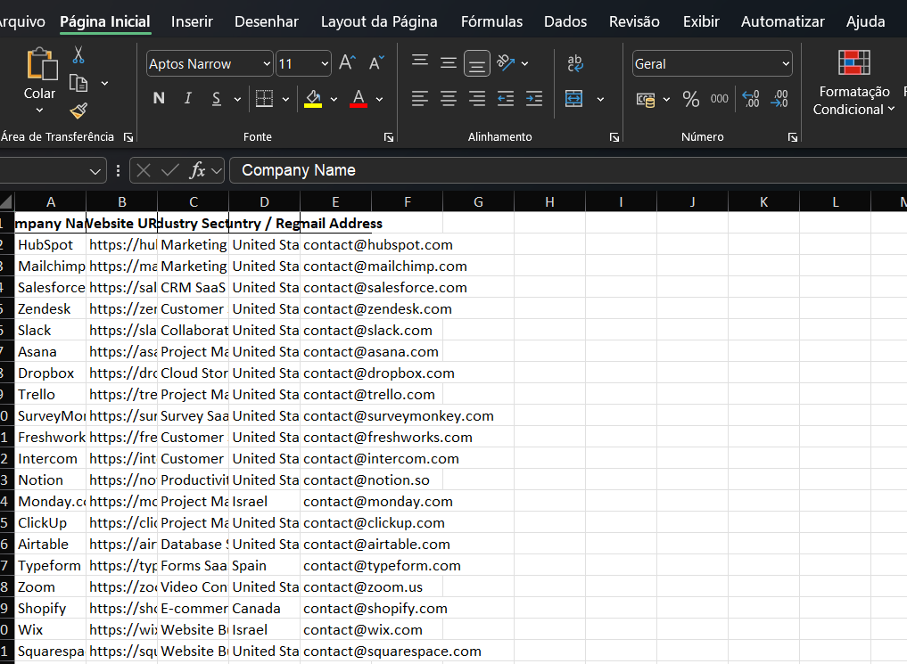

# Automated Web Scraper for SaaS Lead Generation | Python & CSV/XLSX Export

Automatically collects and structures SaaS company data, reducing manual research effort and providing actionable insights for marketing, sales, and market research teams.

This scraper was built in Python and automates the extraction, cleaning, and export of structured SaaS datasets, generating ready‑to‑use outputs in CSV and Excel formats.

---

## ✔ Status
Project completed, fully tested, and ready for demonstration, customization, or integration into production workflows.

---

## 🔧 Technologies Used
- Python
- Requests
- BeautifulSoup4
- Pandas

---

## 📌 Key Features
✔ Extracts structured data from SaaS companies  
✔ Fully automated data collection workflow  
✔ Outputs ready for CRM + analytics pipelines  
✔ Easy to extend with new fields and new sources  
✔ Clean, maintainable, and production-ready code  
✔ Ideal for lead generation and competitive research  

---

## 📈 Why This Project Matters
Companies spend hours manually collecting SaaS data for:
- Lead scoring
- Prospecting
- Market intelligence
- Automation pipelines

This project eliminates that manual overhead through Python automation — a valuable and in-demand skill in the global remote freelance market.  
**This scraper can extract 1,000+ SaaS company records in under 5 minutes, producing CSV and Excel outputs ready for CRM or analytics pipelines.**

---

## 📁 Project Structure

```
.
├── scraper.py            # Main scraping logic
├── requirements.txt      # Dependencies
├── sample_output.csv     # Example extracted dataset
├── data/                 # Exported results (auto-generated)
├── screenshots/          # Visual documentation
└── README.md             # Project documentation
```

---


---


---

## 📸 Execution Preview
Screenshots showing the workflow from execution to output (full-size images in `/screenshots`):

- **Environment Setup**   
- **Script Execution**   
- **Data Extraction**   
- **Output Generation**   
- **CSV/XLSX Output Review**   

---

## 🧾 Sample Output
Example dataset included: `sample_output.csv`  

---

## ▶ How to Run

1. Install dependencies:
```bash
pip install -r requirements.txt

2. Run the scraper:
python scraper.py
3. Check the exported files in /data

---

📦 Output Formats

✔ CSV
✔ Excel (XLSX)

## 📈 Use Cases
- Generate leads quickly for sales teams

- Conduct market research and discover SaaS opportunities

- Automate data collection workflows efficiently

- Perform competitive analysis and benchmarking

- Enrich CRM databases with structured SaaS data


💡 Notes

Code is modular and can be extended to scrape new fields.

Can integrate with APIs or CRMs if needed.

---

## 💡 Notes
- Code is modular and can be extended to scrape new fields.
- Can integrate with APIs or CRMs if needed.

---

## ✔ Status
Project ready for demonstration and extension.
